# PRACTICE/OVERVIEW
```yaml
curl https://raw.githubusercontent.com/KojoRising/CKA_Prep/main/abbreviated_alias.sh > alias.sh && source alias.sh
```

#### 1)
```yaml

```

#### 2) 
```yaml

```

#### 3)
```yaml

```

#### 4)
```yaml

```

#### 5)
```yaml

```

#### 6) Task weight: 2%

(can be solved in any kubectl context)

There are four Kubernetes server binaries located at /opt/course/6/binaries. You're provided with the following verified sha512 values for these:
kube-apiserver f417c0555bc0167355589dd1afe23be9bf909bf98312b1025f12015d1b58a1c62c9908c0067a7764fa35efdac7016a9efa8711a44425dd6692906a7c283f032c
kube-controller-manager 60100cc725e91fe1a949e1b2d0474237844b5862556e25c2c655a33boa8225855ec5ee22fa4927e6c46a60d43a7c4403a27268f96fbb726307d1608b44f38a60
kube-proxy 52f9d8ad045f8eee1d689619ef8ceef2d86d50c75a6a332653240d7ba5b2a114aca056d9e513984ade24358c9662714973c1960c62a5cb37dd375631c8a614c6
kubelet 4be40f2440619e990897cf956c32800dc96c2c983bf64519854a3309fa5aa21827991559f9c44595098e27e6f2ee4d64a3fdec6baba8a177881f20e3ec61e26c
Delete those binaries that don't match with the sha512 values above.

```yaml

```

#### 7) Task weight: 6%
Use context: kubectl config use-context infra-prod
The Open Policy Agent and Gatekeeper have been installed to, among other things, enforce blacklisting of certain image registries. Alter the existing constraint and/or template to also blacklist images from very-bad-registry.com.
Test it by creating a single Pod using image very-bad-registry.com/image in Namespace default, it shouldn't work.
You can also verify your changes by looking at the existing Deployment untrusted in Namespace default, it uses an image from the new untrusted source. The OPA contraint should throw violation messages for this one.
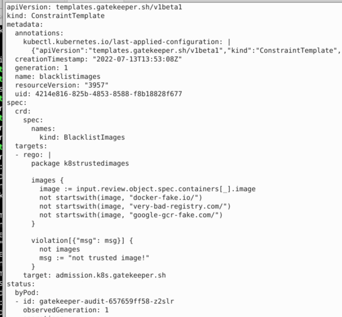

```yaml


```

#### 8) Task weight: 3%
Use context: kubectl config use-context workload-prod

The Kubernetes Dashboard is installed in Namespace kubernetes-dashboard and is configured to:
- Allow users to "skip login"
- Allow insecure access (HTTP without authentication)
- Allow basic authentication
- Allow access from outside the cluster

You are asked to make it more secure by:
- Deny users to "skip login"
- Deny insecure access, enforce HTTPS (self signed certificates are ok for now)
- Add the --auto-generate-certificates argument
- Enforce authentication using a token (with possibility to use RBAC)
- Allow only cluster internal access
```yaml

```

#### 9) Task weight: 3%
Use context: kubectl config use-context workload-prod

Some containers need to run more secure and restricted. There is an existing AppArmor profile located at /opt/course/9/profile for this.
Install the AppArmor profile on Node cluster1-worker1. Connect using ssh cluster1-worker1.
Add label security=apparmor to the Node

Create a Deployment named apparmor in Namespace default with:
- One replica of image nginx:1.19.2
- NodeSelector for security=apparmor
- Single container named c1 with the AppArmor profile enabled
- The Pod might not run properly with the profile enabled. Write the logs of the Pod into /opt/course/9/logs so another team can work on getting the application running.
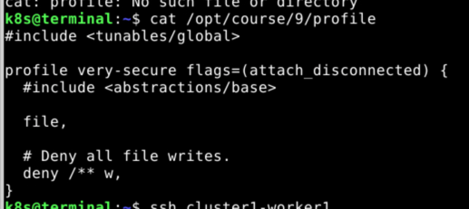
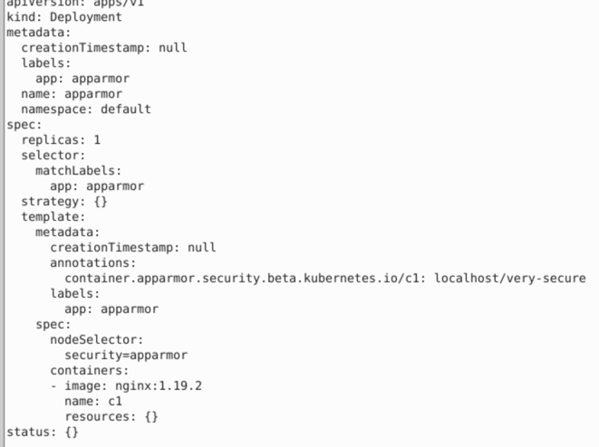

```yaml

```

#### 10) Task weight: 4%
Use context: kubectl config use-context workload-prod
Team purple wants to run some of their workloads more secure. Worker node cluster1-worker2 has container engine containerd already installed and its configured to support the runsc/gvisor runtime.
- Create a RuntimeClass named gvisor with handler runsc.
- Create a Pod that uses the RuntimeClass. The Pod should be in Namespace team-purple, named gvisor-test and of image nginx:1.19.2. Make sure the Pod runs on cluster1-worker2.
- Write the dmesg output of the successfully started Pod into /opt/course/10/gvisor-test-dmesg.
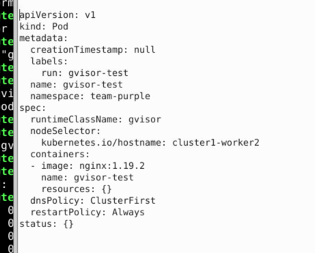
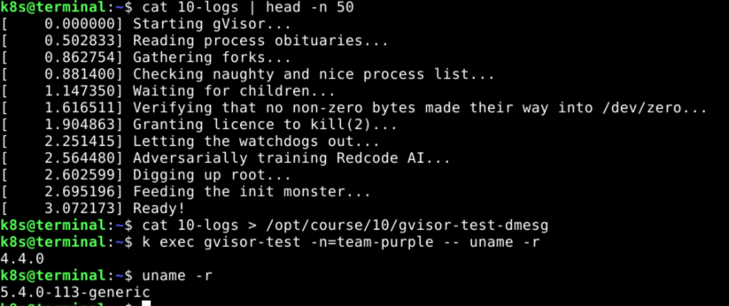
```yaml

```

#### 11) Task weight: 7%
Use context: kubectl config use-context workload-prod
There is an existing Secret called database-access in Namespace team-green.
Read the complete Secret content directly from ETCD (using etcdctl) and store it into /opt/course/11/etcd-secret-content. Write the plain and decoded Secret's value of key "pass" into /opt/course/11/database-password.
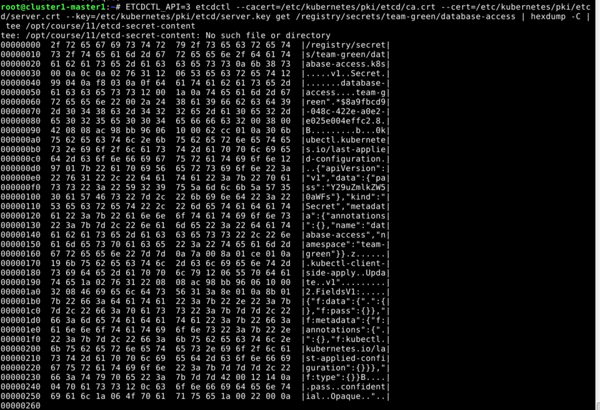
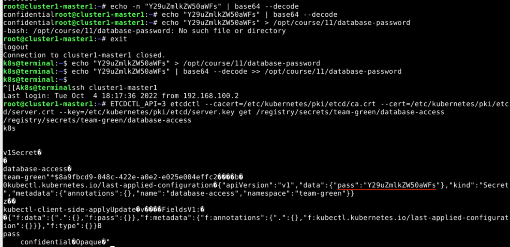
```yaml

```

#### 12) Task weight: 8%
Use context: kubectl config use-context restricted@infra-prod
You're asked to investigate a possible permission escape in Namespace restricted. The context authenticates as user restricted which has only limited permissions and shouldn't be able to read Secret values.
Try to find the password-key values of the Secrets secret1, secret2 and secret3 in Namespace restricted. Write the decoded plaintext values into files /opt/course/12/secret1, /opt/course/12/secret2 and /opt/course/12/secret3
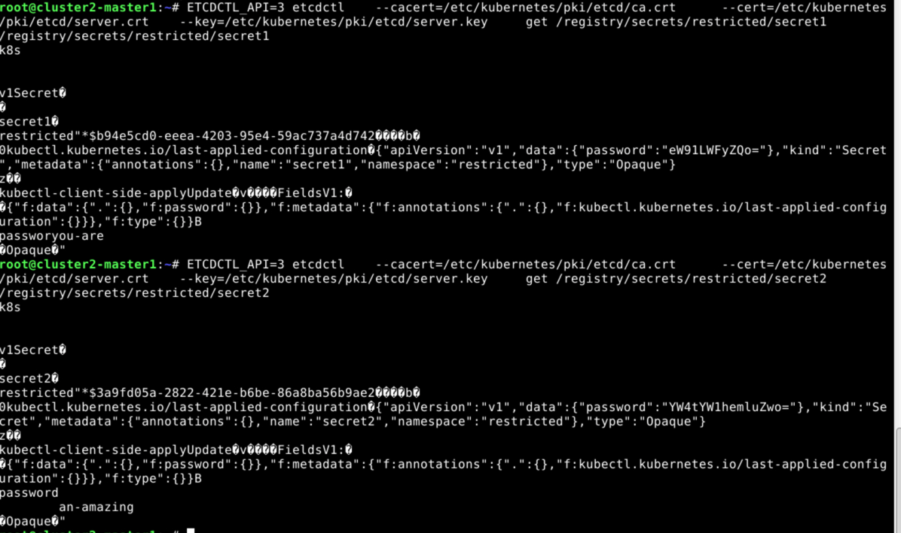
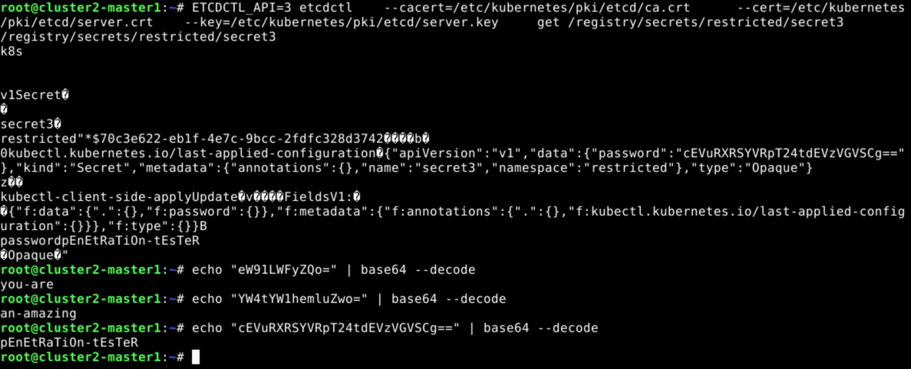
```yaml

```

#### 13) Task weight: 7%
Use context: kubectl config use-context infra-prod
There is a metadata service available at http://192.168.100.21:32000 on which Nodes can reach sensitive data, like cloud credentials for initialisation. By default, all Pods in the cluster also have access to this endpoint. The DevSecOps team has asked you to restrict access to this metadata server.
In Namespace metadata-access:
- Create a NetworkPolicy named metadata-deny which prevents egress to 192.168.100.21 for all Pods but still allows access to everything else
- Create a NetworkPolicy named metadata-allow which allows Pods having label role: metadata-accessor to access endpoint 192.168.100.21
- There are existing Pods in the target Namespace with which you can test your policies, but don't change their labels.
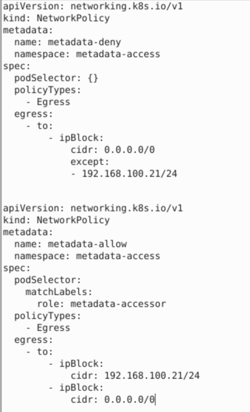
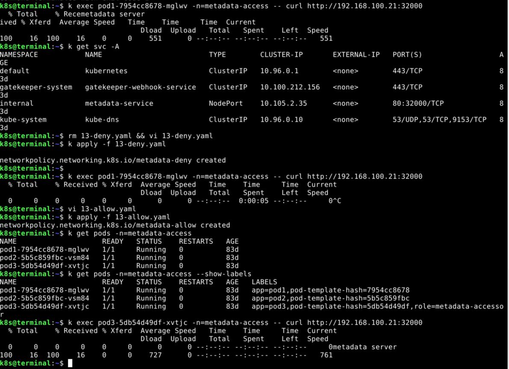
```yaml

```

#### 14) Task weight: 4%
Use context: kubectl config use-context workload-prod
There are Pods in Namespace team-yellow. A security investigation noticed that some processes running in these Pods are using the Syscall kill, which is forbidden by a Team Yellow internal policy.
Find the offending Pod(s) and remove these by reducing the replicas of the parent Deployment to 0.
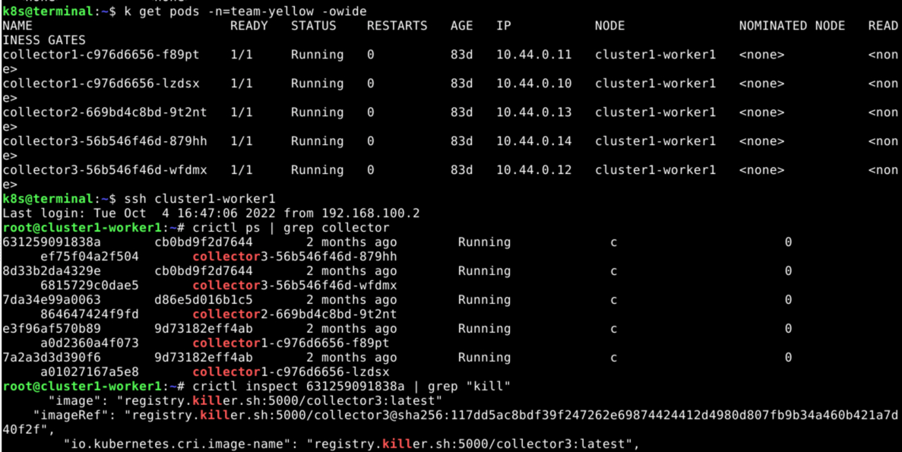
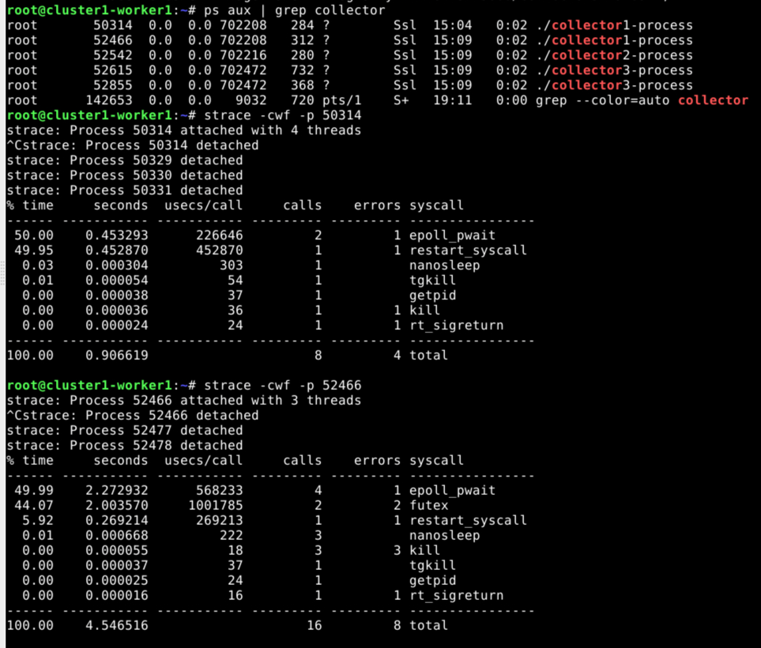
```yaml
k scale deploy/collector1 -n=team-yellow --replicas=0
```

#### 15) Task weight: 4%
Use context: kubectl config use-context workload-prod
In Namespace team-pink there is an existing Nginx Ingress resources named secure which accepts two paths /app and /api which point to different ClusterIP Services.
From your main terminal you can connect to it using for example:
HTTP: curl -v http://secure-ingress.test:31080/app
HTTPS: curl -kv https://secure-ingress.test:31443/app
Right now it uses a default generated TLS certificate by the Nginx Ingress Controller.
You're asked to instead use the key and certificate provided at /opt/course/15/tls.key and /opt/course/15/tls.crt. As it's a self-signed certificate you need to use curl -k when connecting to it.
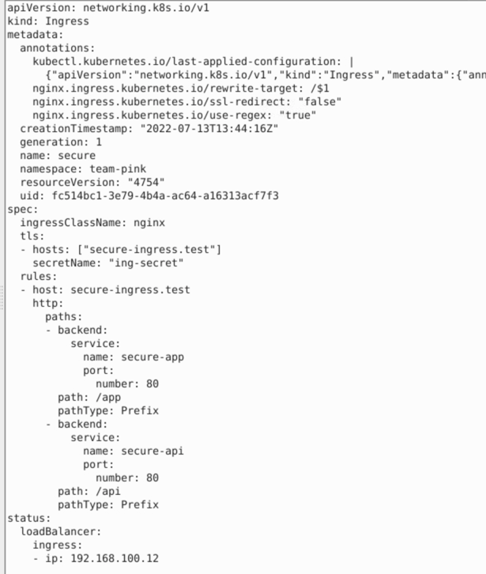
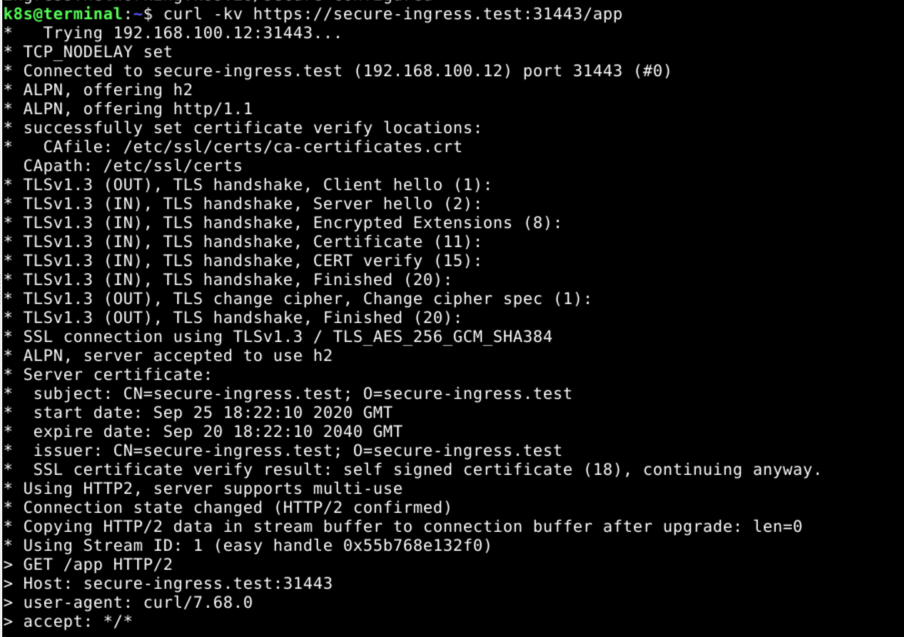
```yaml

```

#### 16) Task weight: 7%
Use context: kubectl config use-context workload-prod
There is a Deployment image-verify in Namespace team-blue which runs image registry.killer.sh:5000/image-verify:v1. DevSecOps has asked you to improve this image by:
- Changing the base image to alpine:3.12
- Not installing curl
- Updating nginx to use the version constraint >=1.18.0
- Running the main process as user myuser
- Do not add any new lines to the Dockerfile, just edit existing ones. The file is located at /opt/course/16/image/Dockerfile.
Tag your version as v2. You can build, tag and push using:
```yaml
cd /opt/course/16/image
podman build -t registry.killer.sh:5000/image-verify:v2 .
podman run registry.killer.sh:5000/image-verify:v2 # to test your changes
podman push registry.killer.sh:5000/image-verify:v2
```
Make the Deployment use your updated image tag v2.

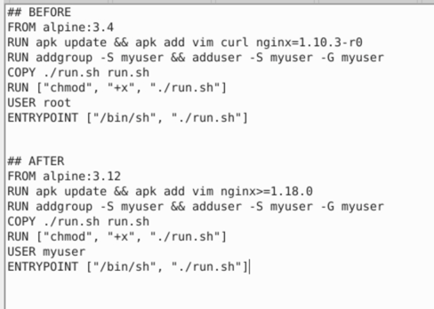

```yaml

```

#### 17) Task weight: 7%
Use context: kubectl config use-context infra-prod
Audit Logging has been enabled in the cluster with an Audit Policy located at /etc/kubernetes/audit/policy.yaml on cluster2-master1.
Change the configuration so that only one backup of the logs is stored.

Alter the Policy in a way that it only stores logs:
- From Secret resources, level Metadata
- From "system:nodes" userGroups, level RequestResponse
- After you altered the Policy make sure to empty the log file so it only contains entries according to your changes, like using truncate -s 0 /etc/kubernetes/audit/logs/audit.log .

NOTE: You can use jq to render json more readable. cat data.json | jq
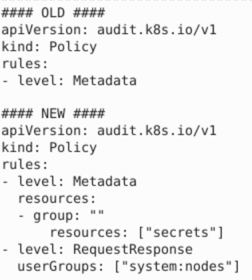
```yaml

```

#### 18) Task weight: 4%
Use context: kubectl config use-context infra-prod
Namespace security contains five Secrets of type Opaque which can be considered highly confidential. The latest Incident-Prevention-Investigation revealed that ServiceAccount p.auster had too broad access to the cluster for some time. This SA should've never had access to any Secrets in that Namespace.
Find out which Secrets in Namespace security this SA did access by looking at the Audit Logs under /opt/course/18/audit.log.
Change the password to any new string of only those Secrets that were accessed by this SA.
NOTE: You can use jq to render json more readable. cat data.json | jq
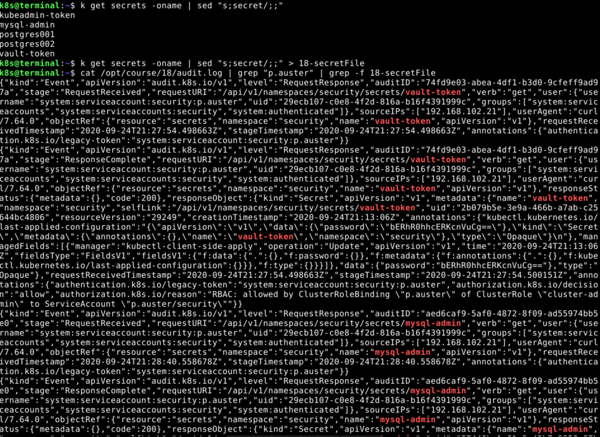
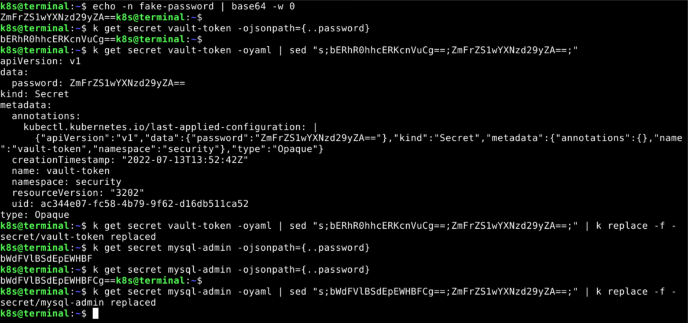
```yaml

```

#### 19) Task weight: 2%
Use context: kubectl config use-context workload-prod
The Deployment immutable-deployment in Namespace team-purple should run immutable, it's created from file /opt/course/19/immutable-deployment.yaml. Even after a successful break-in, it shouldn't be possible for an attacker to modify the filesystem of the running container.
Modify the Deployment in a way that no processes inside the container can modify the local filesystem, only /tmp directory should be writeable. Don't modify the Docker image.
Save the updated YAML under /opt/course/19/immutable-deployment-new.yaml and update the running Deployment.
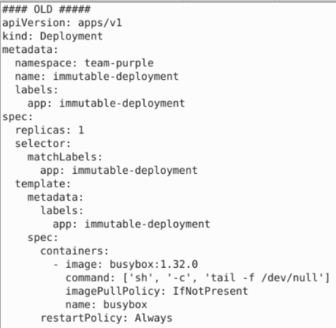
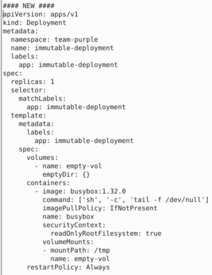
```yaml

```

#### 20) Task weight: 8%
Use context: kubectl config use-context workload-stage
The cluster is running Kubernetes 1.23.1, update it to 1.24.1.
Use apt package manager and kubeadm for this.
Use ssh cluster3-master1 and ssh cluster3-worker1 to connect to the instances.
```yaml
TODO - Copy the apt-get install kubectl/kubelet commands (to execute later on the 2nd node)
```

#### 21) Task weight: 2%
(can be solved in any kubectl context)
The Vulnerability Scanner trivy is installed on your main terminal. Use it to scan the following images for known CVEs:
- nginx:1.16.1-alpine
- k8s.gcr.io/kube-apiserver:v1.18.0
- k8s.gcr.io/kube-controller-manager:v1.18.0
- docker.io/weaveworks/weave-kube:2.7.0
Write all images that don't contain the vulnerabilities CVE-2020-10878 or CVE-2020-1967 into /opt/course/21/good-images.

```yaml

```

#### 22) Task weight: 3%
(can be solved in any kubectl context)
The Release Engineering Team has shared some YAML manifests and Dockerfiles with you to review. The files are located under /opt/course/22/files.
As a container security expert, you are asked to perform a manual static analysis and find out possible security issues with respect to unwanted credential exposure. Running processes as root is of no concern in this task.
Write the filenames which have issues into /opt/course/22/security-issues.
NOTE: In the Dockerfile and YAML manifests, assume that the referred files, folders, secrets and volume mounts are present. Disregard syntax or logic errors.
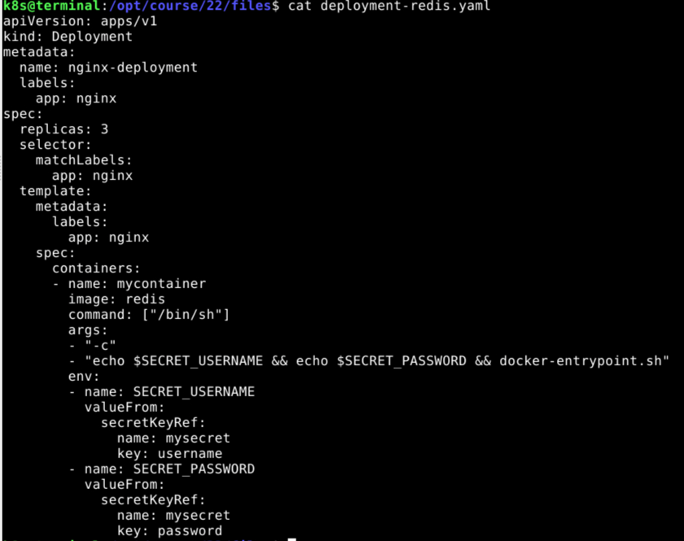

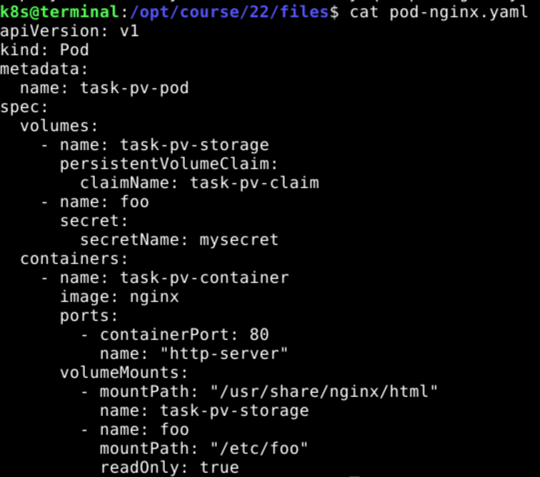

```yaml

```


## TakeAways
Notepad
Use Application->Accessories->Mousepad to write down notes for yourself during the exam.
- Falco - https://falco.org/docs/rules/supported-fields/

1
2
3
4
5
6
7
8
9
10
11
12
13
14
15
16
17
18
19
20
- Upgrading to specific version
  - Kubelet/Kubectl - do `apt list kubectl kubelet -a | grep VERSION` 
  - UNCORDON/CORDON NODES!! - REMEMBER TO UNCORDON NODE!!!
21
22


