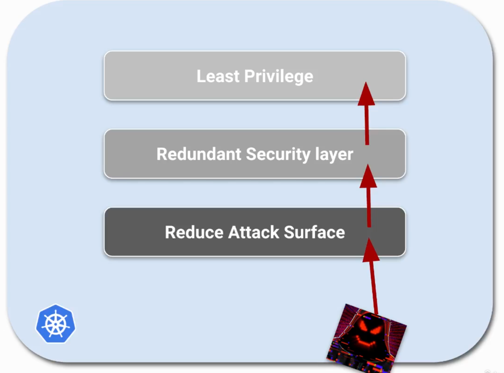
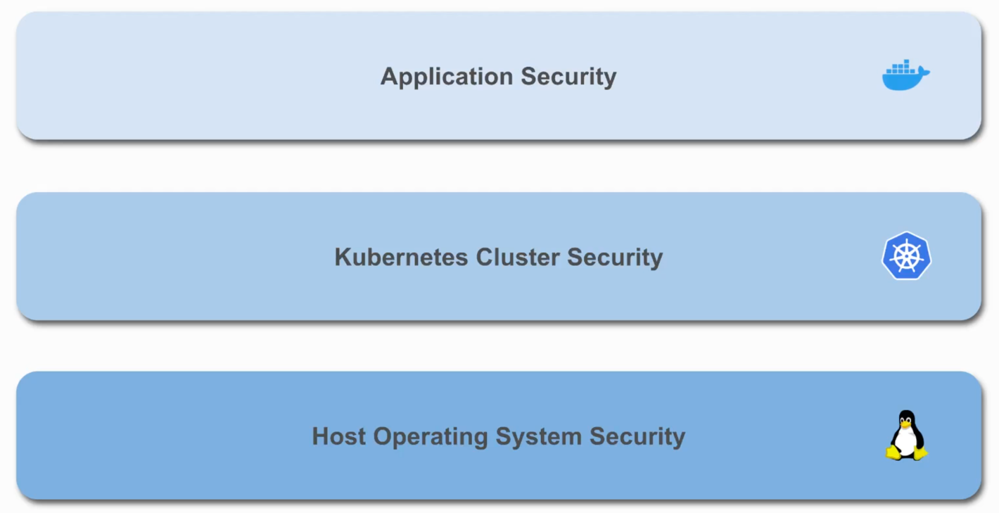
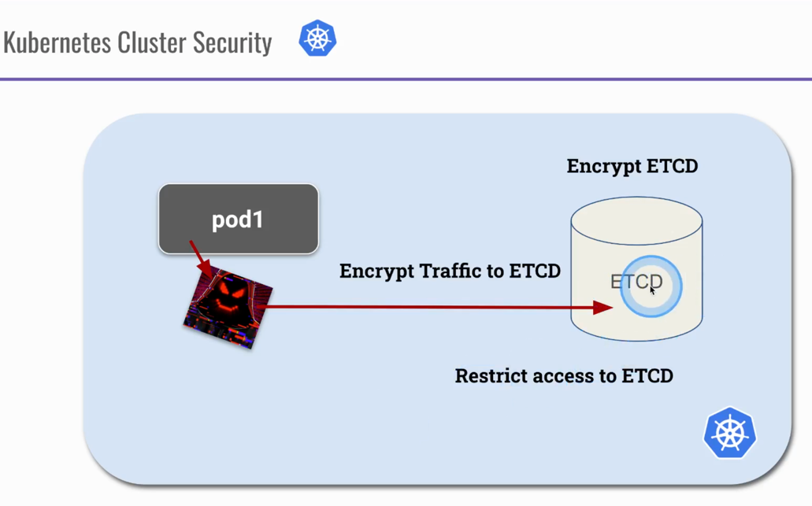

# Introduction

## Overview
1) Security Principles
2) K8s Security Categories
3) K8s Best Practices

## 1) Security Principles

- Defense in Depth - Multiple Layers for Redundancy
- Least Privilege - 
- Limiting the Attack Surface - 

## 2) Kubernetes Security Categories 
a) Host OS Security
b) k8s Cluster Security
c) Application Security

## 2a) Host OS Security (The Bottom)

- k8s Nodes - Should only do k8s
- Reduce Attack Surface
- Runtime Security Surface
- Restrict IAM (Identity Access Management)/SSH Access

## 2b) Kubernetes Cluster Security
- K8s components are secure/running correctly
- Restrict (external) access
- Use Authentication -> Authorization
- AdmissionControllers 
  - NodeRestriction
  - Custom Policies (OPA - Open Policy Agent)
- Enable Audit Logging
- Security Benchmarking

## 2c) Application Security
- Use Secrets (No hardcoded credentials)
- RBAC
- Container Sandboxing (Put Containers into Sandbox/create another security layer)
- Container Hardening
  - Attack Surface
  - Run as nonroot user
  - RO FileSystem
- Vulnerability Scanning
- mTLS/ServiceMeshes
- 

