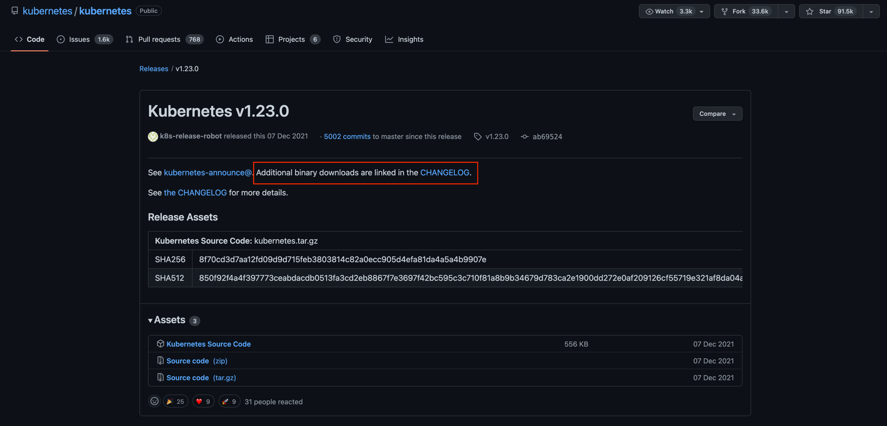

# PRACTICE/OVERVIEW
```yaml
curl https://raw.githubusercontent.com/KojoRising/CKA_Prep/main/abbreviated_alias.sh > alias.sh && source alias.sh
```

1) Use following URL. Replace tag with tag corresponding to your k8s nodes.
```yaml
https://github.com/kubernetes/kubernetes/releases/tag/v1.23.0
https://github.com/kubernetes/kubernetes/blob/master/CHANGELOG/CHANGELOG-1.23.md#server-binaries-10
```


2) Then go to the corresponding changelog page, and wget the server binary
 https://github.com/kubernetes/kubernetes/blob/master/CHANGELOG/CHANGELOG-1.23.md

```yaml
  root@controlplane ~ ➜  wget https://dl.k8s.io/v1.23.0/kubernetes-server-linux-amd64.tar.gz
  --2022-08-28 17:35:11--  https://dl.k8s.io/v1.23.0/kubernetes-server-linux-amd64.tar.gz
  Resolving dl.k8s.io (dl.k8s.io)... 34.107.204.206, 2600:1901:0:26f3::
  Connecting to dl.k8s.io (dl.k8s.io)|34.107.204.206|:443... connected.
  HTTP request sent, awaiting response... 302 Moved Temporarily
Location: https://storage.googleapis.com/kubernetes-release/release/v1.23.0/kubernetes-server-linux-amd64.tar.gz [following]
  --2022-08-28 17:35:11--  https://storage.googleapis.com/kubernetes-release/release/v1.23.0/kubernetes-server-linux-amd64.tar.gz
  Resolving storage.googleapis.com (storage.googleapis.com)... 173.194.194.128, 173.194.196.128, 173.194.197.128, ...
  Connecting to storage.googleapis.com (storage.googleapis.com)|173.194.194.128|:443... connected.
  HTTP request sent, awaiting response... 200 OK
Length: 343018445 (327M) [application/x-tar]
Saving to: ‘kubernetes-server-linux-amd64.tar.gz’

  kubernetes-server-linux-amd64.t 100%[====================================================>] 327.13M   137MB/s    in 2.4s

  2022-08-28 17:35:14 (137 MB/s) - ‘kubernetes-server-linux-amd64.tar.gz’ saved [343018445/343018445]
```

3) Comparing Hash Values. Use `sha512sum` command to get the Hash from the wgetted file, and then compare that with the hash on the website
```yaml
root@controlplane ~ ➜  sha512sum kubernetes-server-linux-amd64.tar.gz | tr ' ' '\n' | head -n 1 | tee actualFile
633cba8102648735b93d91a9840a39597b3242d2489081e71b0131a9bf246e2f52060bc8f8abcc2154f39c1e2410dec5e8b189d220743b55f861062c86edd2f8

root@controlplane ~ ➜  cat actualFile | grep 633cba8102648735b93d91a9840a39597b3242d2489081e71b0131a9bf246e2f52060bc8f8abcc2154f39c1e2410dec5e8b189d220743b55f861062c86edd2f8 -q && echo "Pass" || echo "Fail"
Pass
```

### Checking Running Binaries (vs. Downloaded Binaries)

4) Can't create a shell into the `kube-system` components:

```yaml
root@controlplane ~ ✖ kx kube-apiserver-controlplane -n=kube-system  -- sh
OCI runtime exec failed: exec failed: container_linux.go:367: starting container process caused: exec: "sh": executable file not found in $PATH: unknown
command terminated with exit code 126

root@controlplane ~ ✖ kx kube-apiserver-controlplane -n=kube-system  -- bash
OCI runtime exec failed: exec failed: container_linux.go:367: starting container process caused: exec: "bash": executable file not found in $PATH: unknown
command terminated with exit code 126
```

5) But we can use `crictl` && `ps aux` to gain visibility
```yaml
root@controlplane ~ ✖ crictl ps | grep api
WARN[0000] runtime connect using default endpoints: [unix:///var/run/dockershim.sock unix:///run/containerd/containerd.sock unix:///run/crio/crio.sock unix:///var/run/cri-dockerd.sock]. As the default settings are now deprecated, you should set the endpoint instead. 
WARN[0000] image connect using default endpoints: [unix:///var/run/dockershim.sock unix:///run/containerd/containerd.sock unix:///run/crio/crio.sock unix:///var/run/cri-dockerd.sock]. As the default settings are now deprecated, you should set the endpoint instead. 
b974eeceec757       e6bf5ddd40982                                                                                                 15 minutes ago      Running             kube-apiserver            0                   57c4a026f3a91

root@controlplane ~ ➜  ps aux | grep kube-apiserver
root        3115  0.0  0.1 1117812 324880 ?      Ssl  17:56   1:02 kube-apiserver --advertise-address=10.42.42.9 --allow-privileged=true --authorization-mode=Node,RBAC --client-ca-file=/etc/kubernetes/pki/ca.crt --enable-admission-plugins=NodeRestriction --enable-bootstrap-token-auth=true --etcd-cafile=/etc/kubernetes/pki/etcd/ca.crt --etcd-certfile=/etc/kubernetes/pki/apiserver-etcd-client.crt --etcd-keyfile=/etc/kubernetes/pki/apiserver-etcd-client.key --etcd-servers=https://127.0.0.1:2379 --kubelet-client-certificate=/etc/kubernetes/pki/apiserver-kubelet-client.crt --kubelet-client-key=/etc/kubernetes/pki/apiserver-kubelet-client.key --kubelet-preferred-address-types=InternalIP,ExternalIP,Hostname --proxy-client-cert-file=/etc/kubernetes/pki/front-proxy-client.crt --proxy-client-key-file=/etc/kubernetes/pki/front-proxy-client.key --requestheader-allowed-names=front-proxy-client --requestheader-client-ca-file=/etc/kubernetes/pki/front-proxy-ca.crt --requestheader-extra-headers-prefix=X-Remote-Extra- --requestheader-group-headers=X-Remote-Group --requestheader-username-headers=X-Remote-User --secure-port=6443 --service-account-issuer=https://kubernetes.default.svc.cluster.local --service-account-key-file=/etc/kubernetes/pki/sa.pub --service-account-signing-key-file=/etc/kubernetes/pki/sa.key --service-cluster-ip-range=10.96.0.0/12 --tls-cert-file=/etc/kubernetes/pki/apiserver.crt --tls-private-key-file=/etc/kubernetes/pki/apiserver.key
root       22233  0.0  0.0  13444  1048 pts/1    S+   18:14   0:00 grep --color=auto kube-apiserver
```

6) Finalized Checks:
```yaml
#### 1) USE PS-AUX TO GET PROCESS ID 
root@controlplane ~ ➜  ps aux | grep kube-apiserver | tr -s ' ' '\n' | sed -n "2,2p"
3115

#### 2) CHECK PROCESS DIRECTORY (/proc) for the kube-apiserver root folder
root@controlplane ~ ➜  ls /proc/3115/root/
bin  boot  dev  etc  go-runner  home  lib  proc  root  run  sbin  sys  tmp  usr  var

#### 3) USE FIND COMMAND TO FIND the binary
root@controlplane ~ ➜  find /proc/3115/root/ | grep kube-apiserver
find: ‘/proc/3115/root/proc/tty/driver’: Permission denied
/proc/3115/root/usr/local/bin/kube-apiserver

#### 4) SHA512SUM THE KUBE-APISERVER BINARY
root@controlplane ~ ➜  sha512sum /proc/3115/root/usr/local/bin/kube-apiserver
3dbcc5b914fff998e9fff63ce596b263007438c2158f06e670a1671f0d3c77fe5778077b5192c2f88ae5ed4aef8fe536d49d7d063d1708cce6b02dd30403e8fe  /proc/3115/root/usr/local/bin/kube-apiserver
```
