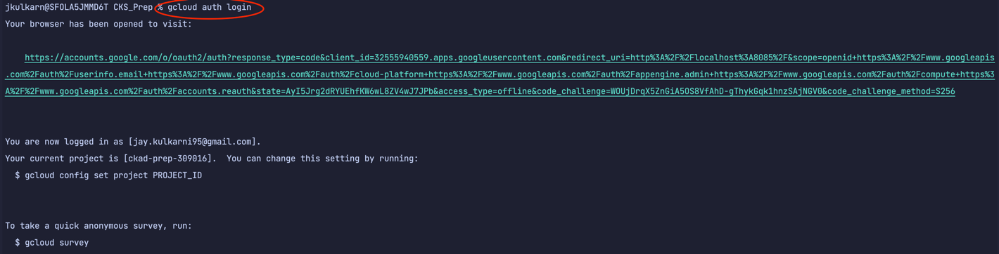

# Introduction

## Overview
1) Setting up gCloud Login
2) K8s Security Categories
3) K8s Best Practices

## 1) Setting up gCloud Login

a) `gcloud auth login`
b) `gcloud projects list`
c) `gcloud config set project [PROJECT_ID]` 
d) `gcloud compute instances list`

